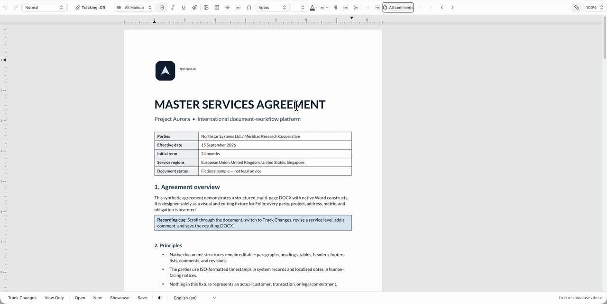

<p align="center">
  
</p>

<p align="center">
  <strong>Editor para navegador e mecanismo independente de framework para documentos OOXML <code>.docx</code>.</strong>
</p>

<p align="center">
  <a href="./README.md">English</a> &middot; <a href="./README.zh-CN.md">简体中文</a> &middot; Português (Brasil)
</p>

<p align="center">
  <a href="https://github.com/stella/stella">stella</a> &middot;
  <a href="https://www.npmjs.com/package/@stll/folio-core">npm</a> &middot;
  <a href="https://github.com/stella/folio/issues">Issues</a> &middot;
  <a href="https://discord.gg/8dZjmVFjTK">Discord</a>
</p>

<p align="center">
  <a href="https://www.npmjs.com/package/@stll/folio-core"></a>
  <a href="https://www.npmjs.com/package/@stll/folio-core"></a>
  <a href="https://github.com/stella/folio/blob/main/LICENSE"></a>
  <a href="https://github.com/stella/folio/issues"></a>
  <a href="https://discord.gg/8dZjmVFjTK"></a>
</p>

# folio

Folio é um editor de documentos do Word incorporável em aplicações web. Passe
um `.docx` como `File`, `Blob`, `ArrayBuffer` ou `Uint8Array`; ele renderiza
conteúdo paginado e editável no navegador e retorna um `.docx` quando o usuário salva.

Use o editor para React, Vue ou Nuxt em uma aplicação, ou use `folio-core`
diretamente para analisar, editar, paginar e revisar documentos sem interface gráfica.

<p align="center">
  
</p>

## Instalação

```sh
bun add @stll/folio-react react react-dom use-intl
```

`@stll/folio-core` é instalado junto com o editor React.

## Início rápido com React

```tsx
import { useState } from "react";
import { IntlProvider } from "use-intl";
import { DocxEditor } from "@stll/folio-react";
import { getFolioMessages } from "@stll/folio-react/messages";
import "@stll/folio-react/standalone.css";

const DOCX_MIME = "application/vnd.openxmlformats-officedocument.wordprocessingml.document";

const downloadDocx = (buffer: ArrayBuffer) => {
  const url = URL.createObjectURL(new Blob([buffer], { type: DOCX_MIME }));
  const link = document.createElement("a");
  link.href = url;
  link.download = "edited.docx";
  document.body.append(link);
  link.click();
  link.remove();
  URL.revokeObjectURL(url);
};

export function Editor() {
  const [file, setFile] = useState<File | null>(null);

  return (
    <IntlProvider locale="en" messages={getFolioMessages("en")}>
      <input
        type="file"
        accept=".docx"
        onChange={(event) => setFile(event.currentTarget.files?.[0] ?? null)}
      />
      {file && <DocxEditor documentBuffer={file} author="Editor" onSave={downloadDocx} />}
    </IntlProvider>
  );
}
```

A barra de ferramentas chama `onSave` com os bytes atualizados do DOCX. Também
é possível manter um `DocxEditorRef` e chamar `await editorRef.current?.save()`.

## O que ele oferece

- Texto paginado, formatação, listas, tabelas, imagens, seções, cabeçalhos e rodapés
- Comentários, notas de rodapé e alterações controladas que o Microsoft Word pode revisar, aceitar ou rejeitar
- Ciclos de leitura e gravação de DOCX que preservam partes intactas do pacote e OOXML não suportado
- Modos de edição, busca, configuração de página, estrutura do documento e callbacks de salvamento
- Mensagens incluídas para 17 localidades, incluindo interfaces da direita para a esquerda

## Escolha um pacote

| Pacote                                    | Use quando precisar de                                                     |
| ----------------------------------------- | -------------------------------------------------------------------------- |
| [`@stll/folio-react`](./packages/react)   | Editor completo como componente React                                      |
| [`@stll/folio-vue`](./packages/vue)       | Editor completo como componente Vue 3                                      |
| [`@stll/folio-nuxt`](./packages/nuxt)     | Registro do editor Vue compatível com SSR no Nuxt 3 ou 4                   |
| [`@stll/folio-core`](./packages/core)     | Análise de DOCX, edição ProseMirror, paginação, revisão ou APIs de redline |
| [`@stll/docx-core`](./packages/docx-core) | Modelo OOXML tipado, validação, serialização e mecanismo de projeção       |
| [`@stll/folio-agents`](./packages/agents) | Ferramentas que leem documentos e propõem comentários ou alterações        |

Instale o editor Vue com `bun add @stll/folio-vue vue`, o módulo Nuxt com
`bun add @stll/folio-nuxt` ou o mecanismo independente de framework com
`bun add @stll/folio-core`.

## Crie uma redline do Word sem um editor

Compare dois arquivos DOCX e grave as diferenças como alterações controladas nativas:

```ts
import { generateRedlineDocx } from "@stll/folio-core/redline";

const result = await generateRedlineDocx(originalDocx, revisedDocx, {
  author: "Reviewer",
});

await store(result.buffer);
```

Para alterações determinísticas em um só documento, use `FolioDocxReviewer`.
Consulte as [APIs de revisão do `folio-core`](./packages/core/README.md#native-word-redlines).

## Notas de integração

- Use apenas `standalone.css`. Aplicações que já usam Tailwind podem seguir a
  [configuração de `editor.css`](./packages/react/README.md#exports).
- O editor requer o DOM. Em uma aplicação com SSR, carregue-o em um componente
  somente de cliente ou por importação dinâmica; usuários de Nuxt podem usar `@stll/folio-nuxt`.
- A arquitetura e a metodologia de testes estão nos documentos sobre os
  [limites da plataforma DOCX](./docs/docx-platform.md) e a
  [interoperabilidade](./docs/interoperability.md).

## Desenvolvimento

```sh
bun install
bun run build
bun run typecheck
bun run test
bun run lint
bun run validate-dist
```

Alterações no código-fonte de pacotes publicados exigem um [Changeset](https://github.com/changesets/changesets).

## Agradecimentos

O Folio se originou como um fork do
[docx-editor](https://github.com/eigenpal/docx-editor) da
[Eigenpal](https://eigenpal.com), criado por
[Jedr Blaszyk](https://github.com/jedrazb), e é mantido de forma independente
como parte do [stella](https://github.com/stella/stella). A licença e os direitos
autorais originais são preservados em [`NOTICE.md`](./NOTICE.md).

## Licença

[Apache-2.0](./LICENSE)
